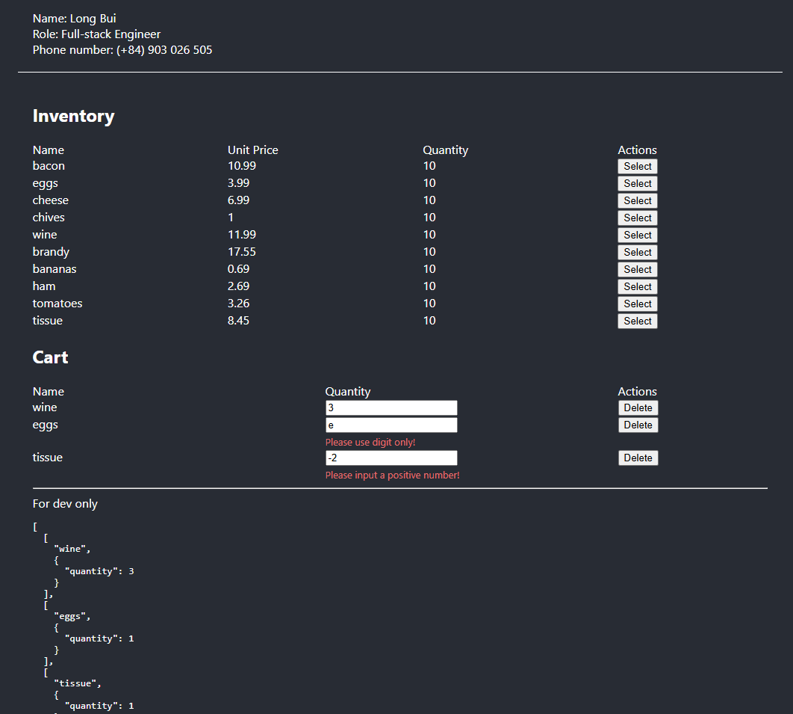

## Author

- Name: Long Bui
- Role: Full-stack Engineer
- Phone number: (+84) 903 026 505

## Project Structure

This repository consists of two parts: the back-end and the front-end. However, since the interview doesn't require the back-end, I’ve removed the API requests from the front-end.

### Quick Start with front-end only

```
# Navigate to the front-end folder
cd front-end-reactjs

# Install dependencies
npm install

# Start the front-end app
npm run start
```

## Output



#### To-do

- Fix bug with the `Select` button — should increase quantity of exited item to the cart
- Show an error message or alert if the number of items in the cart exceeds the available inventory
- Implement logic in the `Purchase` button to deduct purchased quantity from inventory
